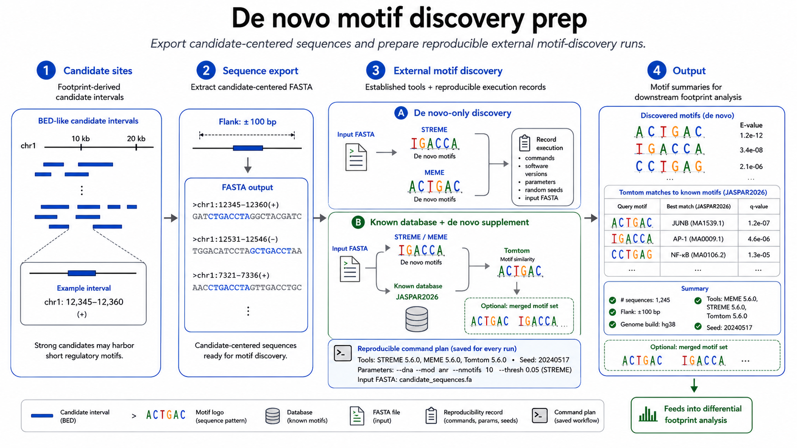
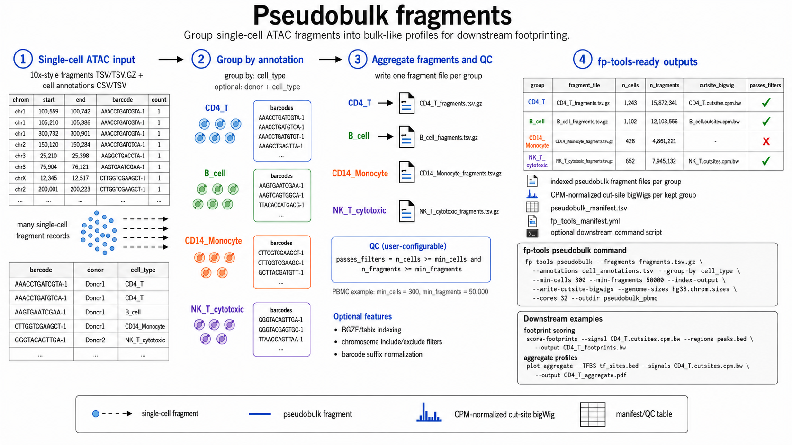
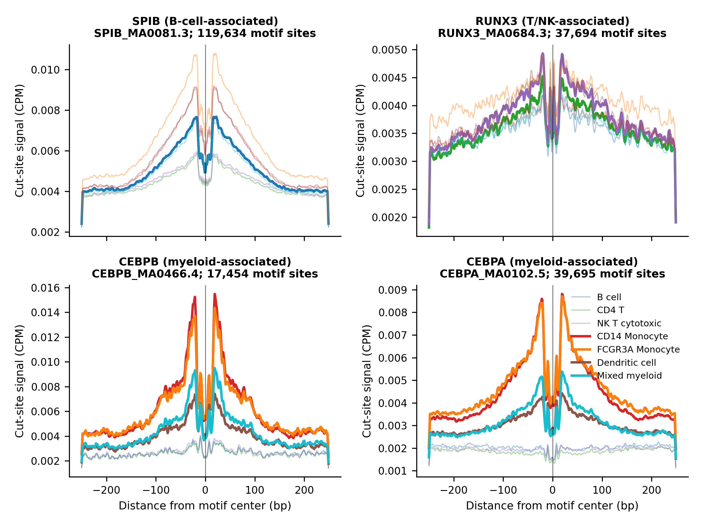
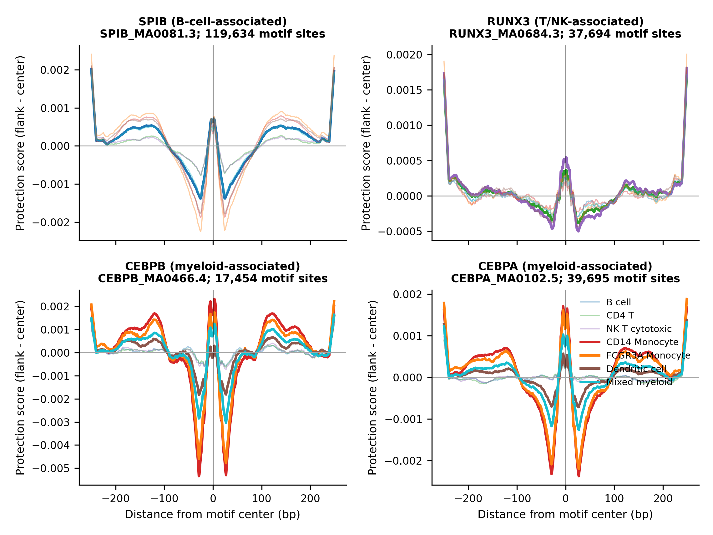

# fp-tools Manual


`fp-tools` is a standalone ATAC-seq footprinting package. It provides command-first tools for Tn5 bias correction, footprint calling, motif matching, differential footprint analysis, aggregate visualization, de novo motif-discovery preparation, and pseudobulk fragment generation.

The PyPI distribution is named `fp-tools-bio`; the installed Python package is `fp_tools`.

## Install

```bash
pip install fp-tools-bio
```

Optional GUI dependencies can be installed with:

```bash
pip install "fp-tools-bio[gui]"
```

## Workflow

The main workflow is:

```text
atac-correct -> call-footprints -> match-motifs / diff-footprints -> plot-aggregate
                                      |                                                               |                          -> plot-aggregate-batch
                                      -> motif-discovery
```

Use `match-motifs` when you want to inspect one sample, infer bound motif sites, or prepare reusable motif-site BED outputs. Use `diff-footprints` when comparing conditions: it scans motifs internally and does not require `match-motifs` to be run first.

## Commands

### Core workflow

- `atac-correct`: correct ATAC-seq cut-site signal for Tn5 sequence bias.
- `call-footprints`: calculate footprint scores and optionally call ranked footprint candidate BED intervals.
- `match-motifs`: scan motifs in one sample and infer bound/unbound motif sites.
- `diff-footprints`: compare motif-associated footprint scores across conditions, replicates, or time courses.
- `plot-aggregate`: plot static aggregate signal around TFBS or region sets.
- `plot-aggregate-batch`: create an interactive multi-sample, multi-TF aggregate HTML report.
- `run-workflow`: run optional YAML batch configs.

### Optional utilities

- `motif-discovery`: prepare candidate-centered de novo motif-discovery runs from FASTA or candidate BED input.
- `motif-summary`: summarize MEME/Tomtom outputs into TSV and HTML reports.
- `pseudobulk-fragments`: group single-cell ATAC fragments into pseudobulk fragment files and manifests.

## Verify

```bash
atac-correct --help
call-footprints --help
match-motifs --help
diff-footprints --help
plot-aggregate --help
plot-aggregate-batch --help
run-workflow --help
motif-discovery --help
motif-summary --help
pseudobulk-fragments --help
```

## Minimal Workflow

Examples omit `--cores`; by default, compute-heavy commands use all available local CPU cores. Set `--cores <n>` only when you want to cap a run.

### 1. Bias-correct cut-site signal

```bash
atac-correct   --bam test_data/Bcell.bam   --genome test_data/genome.fa.gz   --peaks test_data/merged_peaks.bed   --blacklist test_data/blacklist.bed   --outdir examples/atacorrect/Bcell
```

### 2. Call footprints

```bash
call-footprints   --signal examples/atacorrect/Bcell/Bcell_corrected.bw   --regions test_data/merged_peaks.bed   --output examples/footprints/Bcell_footprints.bw   --output-bed examples/footprints/Bcell_candidate_footprints.bed   --top-n 5000
```

The optional BED contains ranked local footprint maxima and can be used as input for de novo motif-discovery preparation.

### 3a. Match motifs in one sample

```bash
match-motifs   --motifs test_data/motifs.jaspar   --signals examples/footprints/Bcell_footprints.bw   --genome test_data/genome.fa.gz   --peaks test_data/merged_peaks_annotated.bed   --peak-header test_data/merged_peaks_annotated_header.txt   --outdir examples/motif_matches/Bcell   --cond-names Bcell
```

### 3b. Compare conditions directly

```bash
diff-footprints   --motifs test_data/motifs.jaspar   --signals test_data/demo_Bcell_rep1_footprints.bw test_data/demo_Bcell_rep2_footprints.bw test_data/demo_Tcell_rep1_footprints.bw test_data/demo_Tcell_rep2_footprints.bw   --aggregate-signals test_data/demo_Bcell_rep1_corrected.bw test_data/demo_Bcell_rep2_corrected.bw test_data/demo_Tcell_rep1_corrected.bw test_data/demo_Tcell_rep2_corrected.bw   --genome test_data/genome.fa.gz   --peaks test_data/merged_peaks_annotated.bed   --peak-header test_data/merged_peaks_annotated_header.txt   --outdir examples/diff_footprints/Bcell_vs_Tcell   --cond-names Bcell Bcell Tcell Tcell   --normalization sample-quantile   --plot-aggregate sig
```

Repeated condition names define biological replicates. `diff-footprints` performs motif scanning internally, writes per-motif BEDs, differential tables, replicate-aware reports, volcano HTML, and aggregate profiles when `--aggregate-signals` is provided.

Differential result tables include raw comparison p-values, BH-adjusted q-values (`<comparison>_qvalue_bh`), and an FDR 5% flag (`<comparison>_significant_fdr05`). The `<comparison>_highlighted` column is a visualization/ranking flag used for reports and should not be interpreted as formal FDR significance.

#### Replicate-aware reports and aggregate embedding

The older replicate-report wording is now covered by `diff-footprints`. There is no primary `fp-tools-replicate-bindetect` command in the current public API. Use `diff-footprints` directly for two-condition, replicate-aware, or ordered time-course differential footprint analysis. Repeated names in `--cond-names` define replicate groups, for example `Bcell Bcell Tcell Tcell`.

`diff-footprints` supports both normalization and no-normalization runs:

```bash
# no cross-sample normalization
diff-footprints ... --normalization none --outdir examples/diff_footprints/Bcell_vs_Tcell_no_norm

# sample-level quantile normalization
diff-footprints ... --normalization sample-quantile --outdir examples/diff_footprints/Bcell_vs_Tcell_sample_quantile
```

When `--aggregate-signals` is supplied, use corrected cut-site bigWigs in the same order as `--signals`. The `--plot-aggregate` option controls aggregate profiles embedded in the comparison HTML:

- `--plot-aggregate sig`: embed significant motifs using `--aggregate-pvalue-threshold` (default).
- `--plot-aggregate top --plot-aggregate-top-n 20`: embed the top N changed motifs.
- `--plot-aggregate all`: embed all motifs.
- `--plot-aggregate off`: write the volcano-style comparison HTML without aggregate profiles.

The replicate diagnostic tables and figure are controlled by `--replicate-report auto|on|off`; `auto` writes them when repeated condition names or `--replicate-map` indicate replicate structure.

### 4. Plot aggregate signal

`plot-aggregate` remains supported for standalone static aggregate plots. It can plot one or more TFBS BED files against one or more corrected cut-site or footprint-score bigWigs, optionally restrict sites with `--regions`, `--whitelist`, or `--blacklist`, and write PDF/PNG plus aggregated signal tables. For footprint-shape figures, corrected cut-site bigWigs are usually the clearest input.

```bash
plot-aggregate   --TFBS examples/motif_matches/Bcell/IRF1_MA0050.2/beds/IRF1_MA0050.2_all.bed   --signals examples/atacorrect/Bcell/Bcell_corrected.bw   --output examples/reports/IRF1_aggregate.pdf   --output_aggregated_scores examples/reports/IRF1_aggregate_scores.csv
```

For replicate-aware aggregate visualization, pass repeated condition names and choose the normalization mode:

```bash
plot-aggregate   --TFBS examples/motif_matches/Bcell/IRF1_MA0050.2/beds/IRF1_MA0050.2_all.bed   --signals examples/atacorrect/Bcell_rep1/Bcell_rep1_corrected.bw examples/atacorrect/Bcell_rep2/Bcell_rep2_corrected.bw examples/atacorrect/Tcell_rep1/Tcell_rep1_corrected.bw examples/atacorrect/Tcell_rep2/Tcell_rep2_corrected.bw   --cond-names Bcell Bcell Tcell Tcell   --normalization sample-quantile   --show-replicate-sd   --normalization-comparison-output examples/reports/IRF1_raw_vs_normalized.pdf   --output examples/reports/IRF1_replicate_aggregate.pdf   --output_aggregated_stats examples/reports/IRF1_replicate_aggregate_stats.csv
```

Supported `plot-aggregate` normalization modes are `none`, `sample-quantile`, and `condition-quantile`. `--normalization-comparison-output` writes a paired raw-vs-normalized figure, which is the direct replacement for the older README examples that compared aggregate plots with and without normalization.

### 5. Review many samples and TFs interactively

Create a manifest:

```text
sample	signal	match_dir	condition
Bcell	examples/atacorrect/Bcell/Bcell_corrected.bw	examples/motif_matches/Bcell	Bcell
Tcell	examples/atacorrect/Tcell/Tcell_corrected.bw	examples/motif_matches/Tcell	Tcell
```

Then run:

```bash
plot-aggregate-batch   --manifest examples/reports/aggregate_manifest.tsv   --output examples/reports/aggregate_browser.html   --top-n 30
```

## Optional de novo motif discovery



`motif-discovery` can start from the candidate BED written by `call-footprints`, export candidate-centered sequences, and write a reproducible MEME/DREME/Tomtom command script.

```bash
motif-discovery   --candidates examples/footprints/Bcell_candidate_footprints.bed   --genome test_data/genome.fa.gz   --outdir examples/motifs/Bcell_denovo   --method dreme   --known-motifs jaspar2026_vertebrates.meme
```

## Optional pseudobulk fragments



`pseudobulk-fragments` groups single-cell ATAC fragments by a metadata column such as cell type, treatment, donor, or cluster. Each group is written as a bulk-like fragment file and manifest entry for downstream footprinting. The example below uses public 10x PBMC fragments and aggregates CPM-normalized pseudobulk cut-site tracks around exact JASPAR2026 motif centers scanned inside 10x peaks. The motif-site summary reports the natural number of motif hits used for each aggregate.

```bash
pseudobulk-fragments   --fragments data/public/raw/10x_pbmc/pbmc_granulocyte_sorted_10k_atac_fragments.tsv.gz   --annotations data/public/processed/pseudobulk_pbmc/pbmc_10x_cell_annotations.tsv   --group-by cell_type   --min-cells 300   --min-fragments 50000   --index-output   --write-cutsite-bigwigs   --genome-sizes data/public/processed/pseudobulk_pbmc/hg38.chrom.sizes   --outdir data/public/processed/pseudobulk_pbmc/run
```

Add `--write-pseudo-bams` when the pseudobulk groups should be passed through `atac-correct`; run those pseudo-paired BAMs with `--read_shift 0 0` so the corrected cuts remain aligned to the fragment start and end cut sites.





## YAML Runner

```bash
run-workflow --config examples/gui_configs/plotaggregate_single.yml
```

YAML is optional for normal command-line use.
