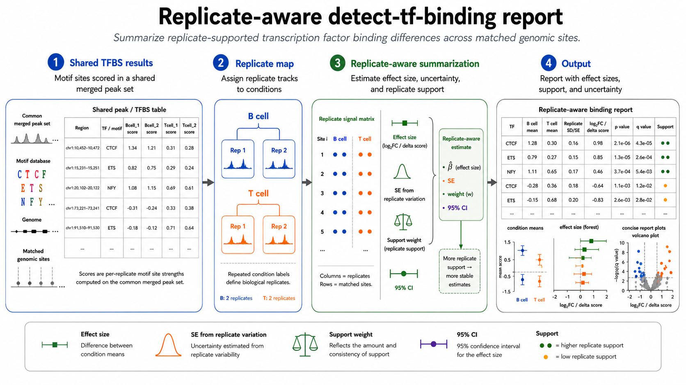

# fp-tools

`fp-tools` is a standalone footprinting package for ATAC-seq style workflows. It provides command-first tools for bias correction, footprint scoring, differential binding detection, and aggregate signal plotting.

The PyPI distribution is named `fp-tools-bio`; the installed Python package is `fp_tools`.

## Install

```bash
pip install fp-tools-bio
```

## Scope

`fp-tools` is focused on a practical current workflow for ATAC-seq
footprinting: Tn5 bias correction, footprint scoring, motif-aware differential
binding, aggregate visualization, de novo motif-discovery preparation, pseudobulk ATAC aggregation, and
replicate-aware reporting.

## Commands

### Core workflow

- `atac-correct`: correct ATAC-seq cutsite signal for Tn5 sequence bias.
- `score-footprints`: calculate footprint, sum, mean, or pass-through scores from bigWig signal.
- `detect-tf-binding`: scan motifs, infer bound sites, and compare TF binding across conditions.
- `plot-aggregate`: plot aggregate signal around TFBS or region sets.
- `fp-tools-run`: run optional YAML batch configs.

### Optional utilities

- `fp-tools-motif-discovery-plan`: prepare candidate-centered sequence input, reproducible de novo motif-discovery runs, and known-motif comparisons.
- `fp-tools-pseudobulk`: group single-cell ATAC fragments into pseudobulk fragment files and manifests.
- `detect-tf-binding`: run replicate-aware differential TF-binding analysis using repeated condition names and optional report output.

Direct command-line usage is the primary interface. YAML configs are optional
for saved or repeated runs.

## Feature Comparison Across the Field

Symbols: ✅ native first-class support, ⚠️ partial or indirect support, ❌ absent.

| Feature | fp-tools | TOBIAS | HINT-<br>ATAC | PRINT /<br>scPrinter | ChromBPNet | maxATAC |
|---|:---:|:---:|:---:|:---:|:---:|:---:|
| Bulk ATAC footprinting | ✅ | ✅ | ✅ | ✅ | ⚠️ | ❌ |
| Tn5 bias correction | ✅ | ✅ | ✅ | ✅ | ✅ | ❌ |
| Classical footprint scoring | ✅ | ✅ | ✅ | ❌ | ❌ | ❌ |
| Motif-aware differential binding | ✅ | ✅ | ⚠️ | ⚠️ | ❌ | ❌ |
| De novo motif-discovery preparation | ✅ | ❌ | ❌ | ✅ | ✅ | ❌ |
| scATAC / pseudobulk support | ✅ | ⚠️ | ⚠️ | ✅ | ⚠️ | ⚠️ |
| Replicate-aware reporting | ✅ | ⚠️ | ⚠️ | ⚠️ | ❌ | ❌ |
| Visualization / reporting | ✅ | ✅ | ⚠️ | ✅ | ✅ | ⚠️ |
| YAML / batch execution | ✅ | ❌ | ❌ | ❌ | ❌ | ❌ |

`fp-tools` is an integrated, reproducible platform that combines classical
footprinting with replicate-aware reporting, de novo motif-discovery preparation,
and single-cell pseudobulk aggregation behind one command surface.

## Verify

```bash
atac-correct --help
score-footprints --help
detect-tf-binding --help
plot-aggregate --help
fp-tools-run --help
fp-tools-motif-discovery-plan --help
fp-tools-pseudobulk --help
```

## Minimal Workflow

### 1. atac-correct

```bash
atac-correct \
  --bam test_data/Bcell.bam \
  --genome test_data/genome.fa.gz \
  --peaks test_data/merged_peaks.bed \
  --blacklist test_data/blacklist.bed \
  --outdir examples/atacorrect/atac-correct_test2 \
  --cores 1
```

### 2. score-footprints

```bash
score-footprints \
  --signal examples/atacorrect/atac-correct_test2/Bcell_corrected.bw \
  --regions test_data/merged_peaks.bed \
  --output examples/scorebigwig/score-footprints_test2/Bcell_footprints.bw \
  --cores 1
```

### Optional de novo motif prep


The de novo motif-prep workflow takes candidate regulatory intervals, extracts
sequence centered on each candidate, and prepares a reproducible external motif
discovery run. It can be used as a standalone discovery step, or as a supplement
to known-motif analysis when a database such as JASPAR 2026 does not yet capture
all motifs active in a dataset. In that second use case, known motifs still anchor
the main TF-binding analysis, while de novo discovery helps reveal recurring
sequence patterns that may be missing, cell-type specific, poorly annotated, or
represented by an unexpected motif family.

Conceptually, the workflow has one user-facing purpose with different parameter
choices: prepare candidate-centered sequence input, optionally compare discovered
motifs to a known motif database, and write concise motif summaries. The important
outputs for biologists are the candidate sequence set, discovered motif logos,
matches to known motifs, enrichment/significance summaries, and a reproducible
record of the external MEME/DREME/Tomtom settings.

```bash
fp-tools-motif-discovery-plan \
  --fasta examples/bindetect/candidate_sites.fa \
  --outdir examples/bindetect/denovo_motifs \
  --method dreme \
  --known-motifs jaspar2026_vertebrates.meme
```

### Optional pseudobulk fragments


The pseudobulk workflow groups single-cell ATAC fragments by a metadata column
such as cell type, treatment, donor, or cluster. Each group is written as a
bulk-like fragment file and manifest entry, so the same footprinting and
aggregate-plot workflow can be applied to biologically interpretable groups. This
is useful when a single-cell experiment has many cells per group but each
individual cell is too sparse for stable footprint profiles.

```bash
fp-tools-pseudobulk \
  --fragments data/public/raw/10x_pbmc/pbmc_granulocyte_sorted_10k_atac_fragments.tsv.gz \
  --annotations data/public/processed/pseudobulk_pbmc/pbmc_10x_cell_annotations.tsv \
  --group-by cell_type \
  --min-cells 300 \
  --min-fragments 50000 \
  --index-output \
  --write-cutsite-bigwigs \
  --genome-sizes data/public/processed/pseudobulk_pbmc/hg38.chrom.sizes \
  --outdir data/public/processed/pseudobulk_pbmc/run
```

Example pseudobulk cut-site aggregate output. Thicker traces mark the expected PBMC lineage context for PAX5 (B cell), TCF7 (T/NK), and CEBPB (myeloid); CTCF is shown as a ubiquitous control. PAX5 and CEBPB have small motif-site sets in this compact example, so they are useful as biology-oriented checks rather than stable quantitative benchmarks.


Example footprint-like protection score derived from the same pseudobulk cut-site tracks. Positive values indicate local center depletion relative to flanks; negative center values indicate accessibility enrichment rather than a clean footprint.


### Replicate-aware detect-tf-binding



Replicate-aware differential binding treats repeated samples from the same
condition as biological replicates rather than unrelated conditions. The workflow
reports condition means, replicate variation, and differential binding summaries,
which makes the output easier to interpret when comparing matched B-cell and
T-cell replicate inputs.

```bash
detect-tf-binding \
  --motifs test_data/motifs.jaspar \
  --signals test_data/demo_Bcell_rep1_footprints.bw test_data/demo_Bcell_rep2_footprints.bw test_data/demo_Tcell_rep1_footprints.bw test_data/demo_Tcell_rep2_footprints.bw \
  --genome test_data/genome.fa.gz \
  --peaks test_data/merged_peaks_annotated.bed \
  --peak-header test_data/merged_peaks_annotated_header.txt \
  --outdir examples/bindetect/detect-tf-binding_replicates_demo \
  --cond-names Bcell Bcell Tcell Tcell \
  --normalization sample-quantile \
  --replicate-report auto \
  --cores 4
```

### 3. detect-tf-binding

```bash
detect-tf-binding \
  --motifs test_data/motifs.jaspar \
  --signals test_data/Bcell_footprints.bw test_data/Tcell_footprints.bw \
  --genome test_data/genome.fa.gz \
  --peaks test_data/merged_peaks_annotated.bed \
  --peak-header test_data/merged_peaks_annotated_header.txt \
  --outdir examples/bindetect/detect-tf-binding_output_htmlfix_014 \
  --cond-names Bcell Tcell \
  --cores 1
```

### 4. plot-aggregate

```bash
plot-aggregate \
  --TFBS test_data/IRF1_all.bed \
  --signals test_data/Bcell_corrected.bw \
  --output examples/reports/plotaggregate_control_mode_test.pdf \
  --output_aggregated_scores examples/reports/plotaggregate_control_mode_test_scores.csv
```

## YAML Runner

Run a saved config directly from the command line:

```bash
fp-tools-run --config examples/gui_configs/plotaggregate_single.yml
```

YAML is optional for normal command-line use.

## Extra Features

### detect-tf-binding skewness report

For multi-condition runs, the skewness report is written automatically to:

```text
<outdir>/bindetect_results_skewness_report.pdf
```

Single-condition runs do not produce this report.

### plot-aggregate Replicate Normalization

```bash
plot-aggregate --TFBS test_data/annotated_tfbs/TFAP2A_Bcell_bound.bed \
  --signals test_data/demo_Bcell_rep1_footprints.bw test_data/demo_Bcell_rep2_footprints.bw test_data/demo_Tcell_rep1_footprints.bw test_data/demo_Tcell_rep2_footprints.bw \
  --signal-labels Bcell_rep1 Bcell_rep2 Tcell_rep1 Tcell_rep2 \
  --cond-names Bcell Bcell Tcell Tcell \
  --normalization sample-quantile \
  --normalization-comparison-output examples/reports/plotaggregate_raw_vs_normalized.png \
  --output examples/reports/plotaggregate_replicate_normalized.pdf \
  --output_aggregated_stats examples/reports/plotaggregate_replicate_normalized_stats.csv \
  --show-replicate-sd
```

Replicate normalization helps align sample-scale differences before condition means are compared. Use the report plots to check that replicate profiles are consistent and that the condition-level center-versus-flank pattern remains interpretable after normalization.

### plot-aggregate Control Overlay

```bash
plot-aggregate --TFBS test_data/IRF1_all.bed \
  --signals test_data/Bcell_corrected.bw test_data/Tcell_corrected.bw \
  --signal-labels Bcell Tcell \
  --control-label Bcell \
  --output examples/reports/plotaggregate_control_mode_test.pdf \
  --output_aggregated_scores examples/reports/plotaggregate_control_mode_test_scores.csv
```

### plot-aggregate Directory Input

```bash
plot-aggregate --TFBS examples/plotaggregate_tfbs_dir \
  --signals test_data/Bcell_corrected.bw \
  --output examples/reports/plotaggregate_dirinput_test.pdf \
  --output_aggregated_scores examples/reports/plotaggregate_dirinput_test_scores.csv
```

### plot-aggregate Fixed Grid Layout

```bash
plot-aggregate --TFBS examples/plotaggregate_tfbs_grid/CTCF_Bcell_bound.bed examples/plotaggregate_tfbs_grid/IRF1_Bcell_bound.bed examples/plotaggregate_tfbs_grid/ETS1_Bcell_bound.bed examples/plotaggregate_tfbs_grid/GATA3_Bcell_bound.bed examples/plotaggregate_tfbs_grid/RUNX1_Bcell_bound.bed \
  --signals test_data/Bcell_corrected.bw test_data/Tcell_corrected.bw \
  --signal-labels Bcell_corrected Tcell_corrected \
  --grid 2x5 \
  --output examples/reports/plotaggregate_grid_2x5_test.pdf \
  --output_aggregated_scores examples/reports/plotaggregate_grid_2x5_test_scores.csv
```

### plot-aggregate CSV Exports

```bash
plot-aggregate --TFBS test_data/IRF1_all.bed \
  --signals test_data/Bcell_corrected.bw \
  --output examples/reports/plotaggregate_signals_export_test.pdf \
  --output_aggregated_signals examples/reports/plotaggregate_signals_export_test_signals.csv \
  --output_aggregated_scores examples/reports/plotaggregate_signals_export_test_scores.csv
```

The legacy `--output-csv` alias writes the aggregated signal CSV.

### Larger Motif Databases

Large JASPAR and HOCOMOCO-scale motif databases are supported through the same detect-tf-binding command path. A JASPAR2026-scale run completed with 1019 motifs.

*Yi Lab, 2026.*
