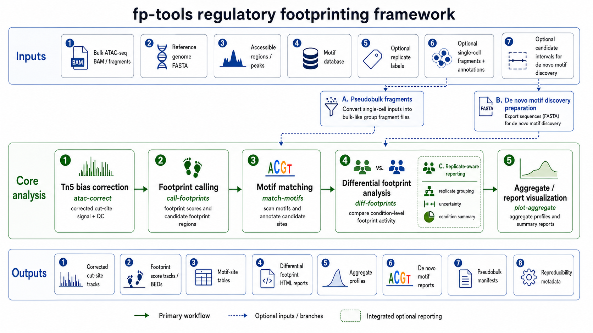
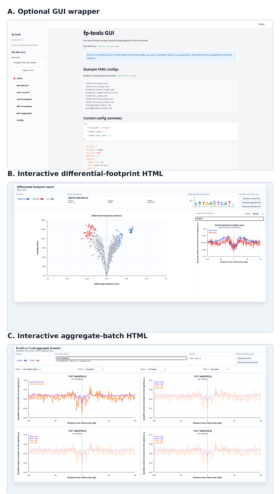
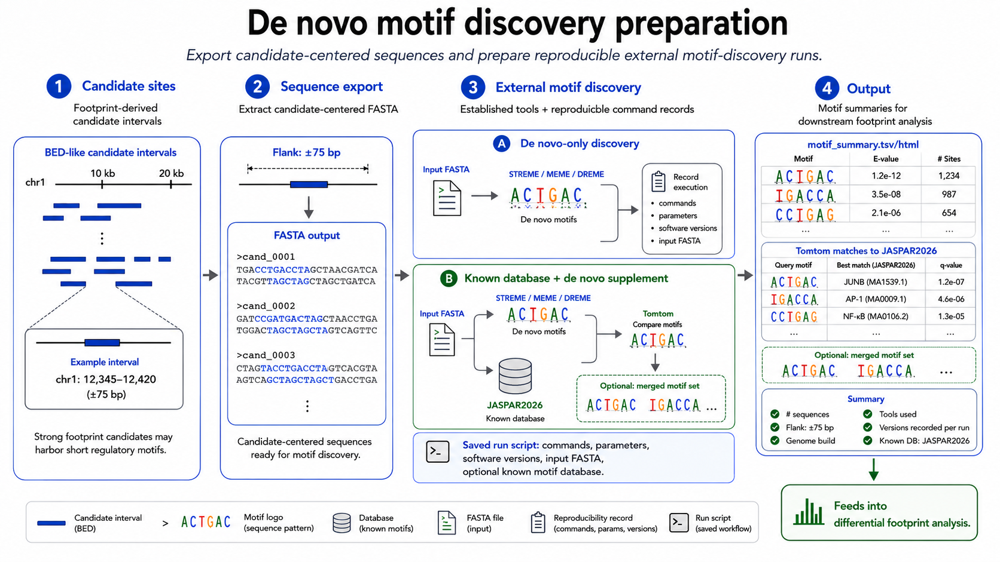
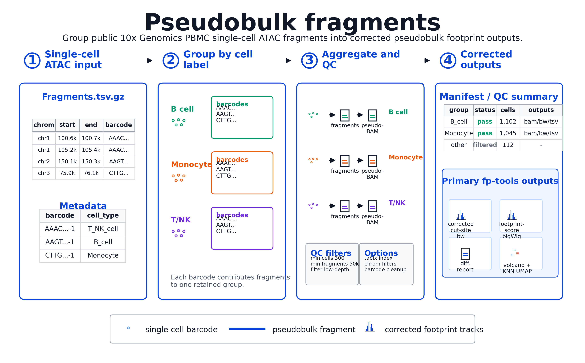
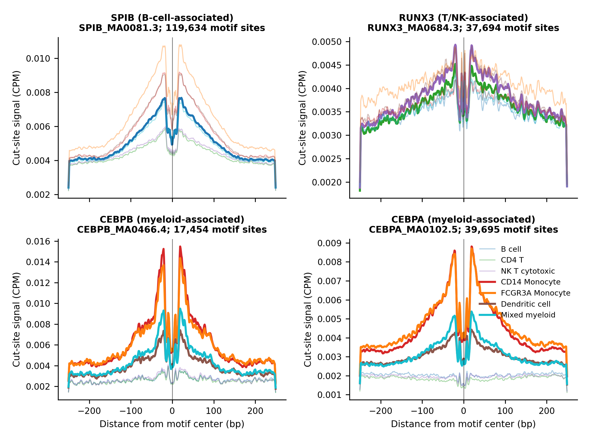
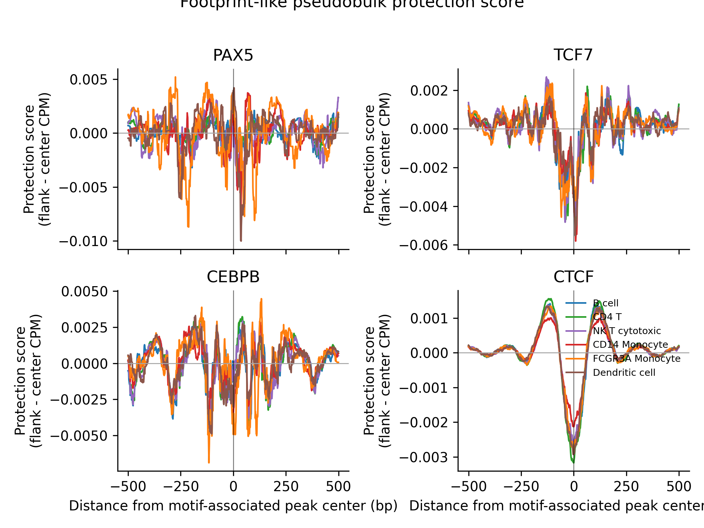

# fp-tools

`fp-tools` is a standalone ATAC-seq footprinting package. It provides command-first tools for Tn5 bias correction, footprint calling, motif matching, differential footprint analysis, aggregate visualization, de novo motif-discovery preparation, and pseudobulk fragment generation.

The PyPI distribution is named `fp-tools-bio`; the installed Python package is `fp_tools`.

## Install

```bash
pip install fp-tools-bio
```

Optional GUI dependencies can be installed with:

```bash
pip install "fp-tools-bio[gui]"
```

## Workflow

The regulatory-footprinting framework below is a generic overview of the current command-first workflow.



The main workflow is:

```text
atac-correct -> call-footprints -> match-motifs / diff-footprints -> normalize-bigwig -> plot-aggregate
                                      |                 |         -> plot-aggregate-batch
                                      -> motif-discovery
```

Use `match-motifs` when you want to inspect one sample, infer bound motif sites, or prepare reusable motif-site BED outputs. Use `diff-footprints` when comparing conditions: it scans motifs internally and does not require `match-motifs` to be run first.

The package remains command-first, but also includes an optional browser GUI and standalone HTML reports for interactive review. The screenshot panel below shows the GUI, a `diff-footprints` report, and a `plot-aggregate-batch` aggregate browser generated from the Buenrostro B-cell versus T-cell replicate comparison.



## Commands

### Core workflow

- `atac-correct`: correct ATAC-seq cut-site signal for Tn5 sequence bias.
- `call-footprints`: calculate footprint scores and optionally call ranked footprint candidate BED intervals.
- `match-motifs`: scan motifs in one sample and infer bound/unbound motif sites.
- `diff-footprints`: compare motif-associated footprint scores across conditions, replicates, or time courses.
- `normalize-bigwig`: background-match corrected or footprint-score bigWigs before aggregate visualization.
- `plot-aggregate`: plot static aggregate signal around TFBS or region sets.
- `plot-aggregate-batch`: create an interactive multi-sample, multi-TF aggregate HTML report.
- `run-workflow`: run optional YAML batch configs.
- `fp-tools-gui`: launch the optional browser GUI installed by `fp-tools-bio[gui]`.

### Optional utilities

- `motif-discovery`: prepare candidate-centered de novo motif-discovery runs from FASTA or candidate BED input.
- `motif-summary`: summarize MEME/Tomtom outputs into TSV and HTML reports.
- `pseudobulk-footprints`: run the full pseudobulk fragment, ATAC correction, footprint scoring, and aggregate-output workflow.
- `pseudobulk-fragments`: group single-cell ATAC fragments into pseudobulk fragment files and manifests.

## Verify

```bash
atac-correct --help
call-footprints --help
match-motifs --help
diff-footprints --help
normalize-bigwig --help
plot-aggregate --help
plot-aggregate-batch --help
run-workflow --help
fp-tools-gui --help
motif-discovery --help
motif-summary --help
pseudobulk-footprints --help
pseudobulk-fragments --help
```

## Minimal Workflow

Examples omit `--cores`; by default, compute-heavy commands use all available local CPU cores. Set `--cores <n>` only when you want to cap a run.

### 1. Bias-correct cut-site signal

```bash
atac-correct   --bam test_data/Bcell.bam   --genome test_data/genome.fa.gz   --peaks test_data/merged_peaks.bed   --blacklist test_data/blacklist.bed   --outdir examples/atacorrect/Bcell
```

### 2. Call footprints

```bash
call-footprints   --signal examples/atacorrect/Bcell/Bcell_corrected.bw   --regions test_data/merged_peaks.bed   --output examples/footprints/Bcell_footprints.bw   --output-bed examples/footprints/Bcell_candidate_footprints.bed   --top-n 5000
```

The optional BED contains ranked local footprint maxima and can be used as input for de novo motif-discovery preparation.

### 3a. Match motifs in one sample

```bash
match-motifs   --motifs test_data/motifs.jaspar   --signals examples/footprints/Bcell_footprints.bw   --genome test_data/genome.fa.gz   --peaks test_data/merged_peaks_annotated.bed   --peak-header test_data/merged_peaks_annotated_header.txt   --outdir examples/motif_matches/Bcell   --cond-names Bcell
```

### 3b. Compare conditions directly

```bash
diff-footprints   --motifs test_data/motifs.jaspar   --signals test_data/demo_Bcell_rep1_footprints.bw test_data/demo_Bcell_rep2_footprints.bw test_data/demo_Tcell_rep1_footprints.bw test_data/demo_Tcell_rep2_footprints.bw   --aggregate-signals test_data/demo_Bcell_rep1_corrected.bw test_data/demo_Bcell_rep2_corrected.bw test_data/demo_Tcell_rep1_corrected.bw test_data/demo_Tcell_rep2_corrected.bw   --genome test_data/genome.fa.gz   --peaks test_data/merged_peaks_annotated.bed   --peak-header test_data/merged_peaks_annotated_header.txt   --outdir examples/diff_footprints/Bcell_vs_Tcell   --cond-names Bcell Bcell Tcell Tcell   --normalization sample-quantile   --plot-aggregate sig
```

Repeated condition names define biological replicates. `diff-footprints` performs motif scanning internally, writes per-motif BEDs, differential tables, replicate-aware reports, volcano HTML, and aggregate profiles when `--aggregate-signals` is provided.

Differential result tables include raw comparison p-values, BH-adjusted q-values (`<comparison>_qvalue_bh`), and an FDR 5% flag (`<comparison>_significant_fdr05`). The `<comparison>_highlighted` column is a visualization/ranking flag used for reports and should not be interpreted as formal FDR significance.

#### Fixed motif-site statistical backends

The default `diff-footprints` backend scans motifs, scores motif-associated footprints, and compares conditions in one command. For method-development and sensitivity analyses, `diff-footprints` can also reuse an existing motif-site reference and quantify every sample over the same fixed sites:

- `--method deseq2-cutcount`: counts raw shifted Tn5 insertions over fixed motif-site windows and analyzes the integer count matrix with PyDESeq2. Install the optional dependency with `pip install "fp-tools-bio[deseq2]"`.
- `--method footprint-score`: quantifies footprint-score signal over the same fixed motif-site windows and applies an empirical-Bayes moderated test for continuous values.

Use `--site-reference-dirs` to provide one or more previous `match-motifs` or `diff-footprints` output directories. `--reference-site-set bound-union` uses the union of bound-site BEDs, while `--reference-site-set all` uses all motif hits. The optional `--score-reference-dir` reuses existing per-site footprint-score columns from a previous `diff-footprints` run and avoids rereading bigWigs.

For exploratory checks only, a footprint-score matrix can be converted outside the core command to integer pseudo-counts and analyzed with DESeq2. This is useful for sensitivity review, but raw shifted Tn5 counts are the statistically cleaner DESeq2 input.

#### Replicate-aware reports and aggregate embedding

The older replicate-report wording is now covered by `diff-footprints`. There is no primary `fp-tools-replicate-bindetect` command in the current public API. Use `diff-footprints` directly for two-condition, replicate-aware, or ordered time-course differential footprint analysis. Repeated names in `--cond-names` define replicate groups, for example `Bcell Bcell Tcell Tcell`.

`diff-footprints` supports both normalization and no-normalization runs:

```bash
# no cross-sample normalization
diff-footprints ... --normalization none --outdir examples/diff_footprints/Bcell_vs_Tcell_no_norm

# sample-level quantile normalization
diff-footprints ... --normalization sample-quantile --outdir examples/diff_footprints/Bcell_vs_Tcell_sample_quantile
```

When `--aggregate-signals` is supplied, use corrected cut-site bigWigs in the same order as `--signals`. The `--plot-aggregate` option controls aggregate profiles embedded in the comparison HTML:

- `--plot-aggregate sig`: embed significant motifs using `--aggregate-pvalue-threshold` (default).
- `--plot-aggregate top --plot-aggregate-top-n 20`: embed the top N changed motifs.
- `--plot-aggregate all`: embed all motifs.
- `--plot-aggregate off`: write the volcano-style comparison HTML without aggregate profiles.


Embedded aggregate profiles are TOBIAS-style motif-centered profiles: `diff-footprints` plots corrected cut-site bigWigs over per-motif BED outputs scanned within the supplied peak set. Use `--aggregate-site-set all` for `<motif>_all.bed`, or `--aggregate-site-set bound` for condition-specific `<motif>_<condition>_bound.bed` subsets. If you pass raw corrected bigWigs directly, `--aggregate-normalization size-factor` remains available as plot-only multiplicative scaling, but saved `normalize-bigwig` outputs are the recommended path for reproducible figures.

The replicate diagnostic tables and figure are controlled by `--replicate-report auto|on|off`; `auto` writes them when repeated condition names or `--replicate-map` indicate replicate structure.

#### Normalize corrected bigWigs for aggregate plots

For TOBIAS-style `*_corrected.bw` cut-site tracks, the recommended pre-aggregation normalization is robust high-tail scaling rather than full quantile normalization. Use `--stat q90` for broad background matching, and use shared peak-universe `--stat q95` for motif-centered aggregate visualization, where profiles are dominated by accessible peak and motif regions.

```bash
normalize-bigwig \
  --bigwigs \
    examples/atacorrect/Bcell_rep1/Bcell_rep1_corrected.bw \
    examples/atacorrect/Bcell_rep2/Bcell_rep2_corrected.bw \
    examples/atacorrect/Tcell_rep1/Tcell_rep1_corrected.bw \
    examples/atacorrect/Tcell_rep2/Tcell_rep2_corrected.bw \
  --background examples/reference/background.50bp.bed \
  --method background-scale \
  --stat q90 \
  --target median \
  --outdir examples/normalized_corrected_bigwigs
```

The command writes normalized bigWigs plus `normalize_bigwig_qc.tsv`, which records each sample's background median, q90, q95, q97.5, q99, MAD, IQR, selected scaling statistic, target statistic, and scale factor. If a scale factor is very large or small, inspect library quality and the background BED before using the plot.

Use the normalized corrected bigWigs for aggregate visualization, and disable any second aggregate-level normalization:

```bash
diff-footprints \
  ... \
  --aggregate-signals \
    examples/normalized_corrected_bigwigs/Bcell_rep1_corrected.background_scale_q95.bw \
    examples/normalized_corrected_bigwigs/Bcell_rep2_corrected.background_scale_q95.bw \
    examples/normalized_corrected_bigwigs/Tcell_rep1_corrected.background_scale_q95.bw \
    examples/normalized_corrected_bigwigs/Tcell_rep2_corrected.background_scale_q95.bw \
  --aggregate-normalization none
```

For corrected cut-site bigWigs, use `--method background-scale` with `--stat q90` by default for broad background matching. For motif aggregate figures, `--stat q95` is the recommended aggregate-friendly setting; `q97.5` and `q99` are available for sensitivity checks when the peak universe is clean. For footprint-score bigWigs, `--method background-zscore` is available when you want background-centered score tracks. Full quantile normalization is not the default recommendation for primary differential footprint interpretation.


If motif-level outputs are already complete, `--reuse-existing-results` can regenerate the final `diff_footprints_<comparison>.html` report from the existing `<prefix>_results.txt` table and per-motif BED files. This is report-only reuse: it avoids motif rescanning, but it does not convert one normalization mode into another.

### 4. Plot aggregate signal

`plot-aggregate` remains supported for standalone static aggregate plots. It can plot one or more TFBS BED files against one or more corrected cut-site or footprint-score bigWigs, optionally restrict sites with `--regions`, `--whitelist`, or `--blacklist`, and write PDF/PNG plus aggregated signal tables. For footprint-shape figures, corrected cut-site bigWigs are usually the clearest input.

```bash
plot-aggregate   --TFBS examples/motif_matches/Bcell/IRF1_MA0050.2/beds/IRF1_MA0050.2_all.bed   --signals examples/atacorrect/Bcell/Bcell_corrected.bw   --output examples/reports/IRF1_aggregate.pdf   --output_aggregated_scores examples/reports/IRF1_aggregate_scores.csv
```

For replicate-aware aggregate visualization, pass repeated condition names. If the corrected bigWigs were already processed by `normalize-bigwig`, keep `--normalization none` here:

```bash
plot-aggregate \
  --TFBS examples/motif_matches/Bcell/IRF1_MA0050.2/beds/IRF1_MA0050.2_all.bed \
  --signals \
    examples/normalized_corrected_bigwigs/Bcell_rep1_corrected.background_scale_q95.bw \
    examples/normalized_corrected_bigwigs/Bcell_rep2_corrected.background_scale_q95.bw \
    examples/normalized_corrected_bigwigs/Tcell_rep1_corrected.background_scale_q95.bw \
    examples/normalized_corrected_bigwigs/Tcell_rep2_corrected.background_scale_q95.bw \
  --cond-names Bcell Bcell Tcell Tcell \
  --normalization none \
  --show-replicate-sd \
  --output examples/reports/IRF1_replicate_aggregate.pdf \
  --output_aggregated_stats examples/reports/IRF1_replicate_aggregate_stats.csv
```

Supported `plot-aggregate` in-memory normalization modes are `none`, `sample-quantile`, and `condition-quantile`. For publication-style corrected cut-site aggregate plots, prefer `normalize-bigwig --method background-scale` first and then plot with `--normalization none`. `--normalization-comparison-output` remains available for exploratory raw-vs-normalized figures.

### 5. Review many samples and TFs interactively

Create a manifest:

```text
sample	signal	match_dir	condition
Bcell	examples/atacorrect/Bcell/Bcell_corrected.bw	examples/motif_matches/Bcell	Bcell
Tcell	examples/atacorrect/Tcell/Tcell_corrected.bw	examples/motif_matches/Tcell	Tcell
```

Then run from manifest inputs when profiles should be computed from corrected cut-site bigWigs and `match-motifs` outputs:

```bash
plot-aggregate-batch   --manifest examples/reports/aggregate_manifest.tsv   --output examples/reports/aggregate_browser.html   --top-n 30   --default-layout 2x2
```

The generated standalone HTML uses a compressed embedded payload and supports searchable TF selection, editable group colors, 1x1/1x2/2x2/2x3 layouts, and per-panel choices for all condition means, all samples, one condition, or one sample. If aggregate profiles are already embedded in one or more `diff-footprints` reports, reuse them without recomputing bigWig profiles:

```bash
plot-aggregate-batch   --input-html examples/diff_footprints/Bcell_vs_Tcell/diff_footprints_Bcell_Tcell.html   --output examples/reports/aggregate_browser_from_html.html   --default-layout 2x3
```

## Optional de novo motif discovery



The schematic above is a generic method workflow: it starts from footprint-derived candidate intervals, exports candidate-centered FASTA, records external MEME/STREME/Tomtom execution settings, and returns motif summaries that can be used downstream. `motif-discovery` can be run as de novo-only discovery, or with a known database such as JASPAR2026 so discovered motifs can supplement database-supported motif analysis.

```bash
motif-discovery   --candidates examples/footprints/Bcell_candidate_footprints.bed   --genome test_data/genome.fa.gz   --outdir examples/motifs/Bcell_denovo   --method streme   --known-motifs jaspar2026_vertebrates.meme
```

## Optional pseudobulk footprints



The recommended single-cell route is the full corrected pseudobulk footprint workflow. `pseudobulk-footprints` accepts either 10x-style fragments or a real all-cell BAM with cell barcodes in a read tag. Fragment input writes indexed pseudobulk fragment files, raw cut-site bigWigs for QC, pseudo-paired BAMs, and runs `atac-correct --read_shift 0 0`. Tagged BAM input splits the real BAM by metadata group and uses the standard ATAC shift `--read_shift 4 -5` unless overridden. Both routes score corrected footprints, can run motif-aware `diff-footprints` when `--motifs` is supplied, and write a manifest with every intermediate and final output path.

```bash
pseudobulk-footprints   --fragments data/public/raw/10x_pbmc/pbmc_granulocyte_sorted_10k_atac_fragments.tsv.gz   --annotations data/public/processed/pseudobulk_pbmc/pbmc_10x_cell_annotations.tsv   --group-by cell_type   --min-cells 300   --min-fragments 50000   --genome-sizes data/public/processed/pseudobulk_pbmc/hg38.chrom.sizes   --genome data/public/raw/genome/hg38.fa   --peaks data/public/raw/10x_pbmc/pbmc_granulocyte_sorted_10k_atac_peaks.bed   --motifs data/public/raw/jaspar/2026/JASPAR2026_CORE_vertebrates_non-redundant_pfms_jaspar.txt   --tf-site-dir data/public/processed/pseudobulk_pbmc/tf_sites_motif_centered   --site-summary data/public/processed/pseudobulk_pbmc/tf_sites_motif_centered/motif_centered_site_summary.tsv   --tfs auto   --outdir data/public/processed/pseudobulk_pbmc/footprints_full   --cores 8
```

For datasets that already have a tagged BAM, use the TOBIAS-style BAM route instead:

```bash
pseudobulk-footprints   --bam all_cells.bam   --bam-barcode-tag CB   --annotations cell_annotations.tsv   --group-by cell_type   --min-cells 300   --min-fragments 50000   --genome hg38.fa   --peaks peaks.bed   --blacklist hg38.blacklist.bed   --motifs JASPAR2026_CORE_vertebrates_non-redundant_pfms_jaspar.txt   --outdir pseudobulk_footprints   --cores 8
```

Key outputs include `pseudobulk_footprint_manifest.tsv`, `pseudobulk_footprint_commands.sh`, pseudobulk BAMs, fragment-route raw cut-site QC tracks, `atacorrect/<group>/<group>_corrected.bw`, `footprints/<group>.footprints.bw`, `footprints/<group>.candidate_footprints.bed`, optional motif-aware `bindetect/` outputs, and corrected footprint aggregate plots under `plots/`.

Use `pseudobulk-fragments` when you only need grouping, fragment files, raw cut-site tracks, or pseudo-BAMs for a custom downstream workflow:

```bash
pseudobulk-fragments   --fragments data/public/raw/10x_pbmc/pbmc_granulocyte_sorted_10k_atac_fragments.tsv.gz   --annotations data/public/processed/pseudobulk_pbmc/pbmc_10x_cell_annotations.tsv   --group-by cell_type   --min-cells 300   --min-fragments 50000   --index-output   --write-cutsite-bigwigs   --write-pseudo-bams   --genome-sizes data/public/processed/pseudobulk_pbmc/hg38.chrom.sizes   --outdir data/public/processed/pseudobulk_pbmc/run
```

Raw CPM cut-site aggregates are useful QC and context. Corrected footprint claims should use the `pseudobulk-footprints` outputs after `atac-correct` and `call-footprints`.





The PBMC5k single-cell ATAC demonstration uses the original 10x Genomics
`atac_pbmc_5k_nextgem` public dataset to prepare broad cell-type annotations,
motif-centered marker sites, and a KNN-smoothed per-cell footprint-signature UMAP:

```bash
python benchmarks/scripts/prepare_10x_pbmc5k_scatac.py --chroms chr1,chr2
python manuscript/scripts/prepare_pseudobulk_motif_sites.py \
  --peaks data/public/raw/10x_pbmc5k_scatac/atac_pbmc_5k_snatac2_selected_bins.demo.bed \
  --genome data/public/raw/genome/hg38.fa \
  --motifs data/public/raw/jaspar/2026/JASPAR2026_CORE_vertebrates_non-redundant_pfms_jaspar.txt \
  --outdir data/public/processed/pseudobulk_pbmc5k_scatac/tf_sites_motif_centered \
  --summary data/public/processed/pseudobulk_pbmc5k_scatac/tf_sites_motif_centered/motif_centered_site_summary.tsv \
  --candidates 'B_cell:PAX5;T_NK:TCF7;Myeloid:CEBPB' \
  --chroms chr1,chr2 \
  --plot-sites-per-tf 1500 \
  --motif-pvalue 1e-4
python benchmarks/scripts/plot_pbmc5k_per_cell_signatures.py \
  --annotations data/public/processed/pseudobulk_pbmc5k_scatac/pbmc5k_scprinter_broad_annotations.tsv \
  --fragments data/public/raw/10x_pbmc5k_scatac/atac_pbmc_5k_nextgem_fragments.tsv.gz \
  --h5ad data/public/raw/10x_pbmc5k_scatac/atac_pbmc_5k_annotated.h5ad \
  --tf-site-dir data/public/processed/pseudobulk_pbmc5k_scatac/tf_sites_motif_centered \
  --outdir data/public/processed/pseudobulk_pbmc5k_scatac/footprint_demo/plots/per_cell_signature_demo \
  --markers PAX5,CEBPB,TCF7
```

## YAML Runner

```bash
run-workflow --config examples/gui_configs/plotaggregate_single.yml
```

YAML is optional for normal command-line use.
