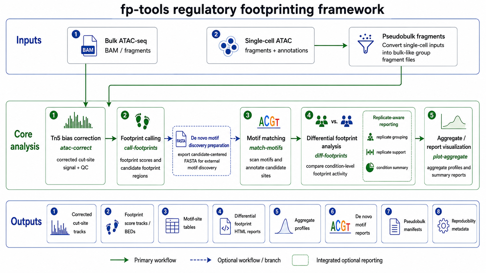

<section class="fp-hero">
  <div>
    
    <p class="fp-eyebrow">Command-first ATAC-seq footprinting</p>
    <h1>Bias correction, footprint scoring, motif-aware comparisons, and reports.</h1>
    <p class="fp-lede">
      fp-tools is a Python package for reproducible ATAC-seq footprint workflows,
      from corrected cut-site tracks to differential motif reports, aggregate browsers,
      de novo motif preparation, and pseudobulk single-cell ATAC analysis.
    </p>
    <div class="fp-actions">
      <a class="fp-button primary" href="workflow/">Start workflow</a>
      <a class="fp-button" href="commands/">Command reference</a>
      <a class="fp-button" href="reports/">Report demos</a>
    </div>
    <div class="fp-install">pip install fp-tools-bio</div>
  </div>
  <div class="fp-hero-visual">
    
  </div>
</section>

The PyPI distribution is `fp-tools-bio`; the import package is `fp_tools`.

## Core Capabilities

<div class="fp-grid">
  <div class="fp-card">
    <h3>Correct cut-site tracks</h3>
    <p>Run Tn5 bias correction and footprint scoring from BAM, FASTA, peak, and blacklist inputs.</p>
  </div>
  <div class="fp-card">
    <h3>Compare motif footprints</h3>
    <p>Use diff-footprints for motif scanning, bound-site inference, replicate-aware tables, and volcano reports.</p>
  </div>
  <div class="fp-card">
    <h3>Review aggregate signal</h3>
    <p>Create static aggregate plots or standalone interactive HTML browsers for many samples and TFs.</p>
  </div>
  <div class="fp-card">
    <h3>Prepare de novo motifs</h3>
    <p>Export footprint-centered candidate FASTA files and summarize MEME/STREME/Tomtom validation outputs.</p>
  </div>
  <div class="fp-card">
    <h3>Run pseudobulk workflows</h3>
    <p>Group single-cell fragments or tagged BAMs into pseudobulk tracks and marker-focused reports.</p>
  </div>
  <div class="fp-card">
    <h3>Use optional interfaces</h3>
    <p>Keep CLI-first reproducibility while using YAML configs, Streamlit GUI screens, and static HTML reports.</p>
  </div>
</div>

## Quick Command Chain

<div class="fp-command-chain">
  atac-correct -> call-footprints -> match-motifs / diff-footprints -> normalize-bigwig -> plot-aggregate / plot-aggregate-batch
</div>

For most two-condition analyses, start with `diff-footprints`; it scans motifs internally, handles repeated condition names as replicates, writes differential tables, and can embed aggregate profiles into standalone HTML reports.

Optional extras:

```bash
pip install "fp-tools-bio[gui]"
pip install "fp-tools-bio[deseq2]"
```
